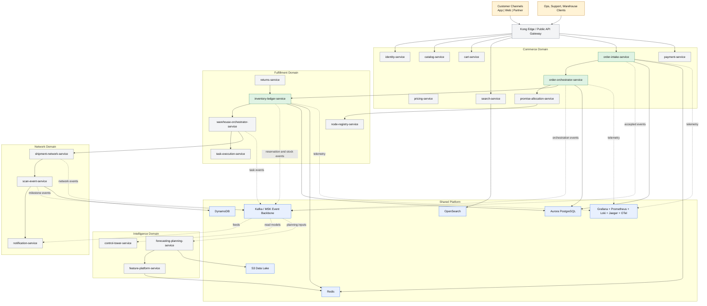
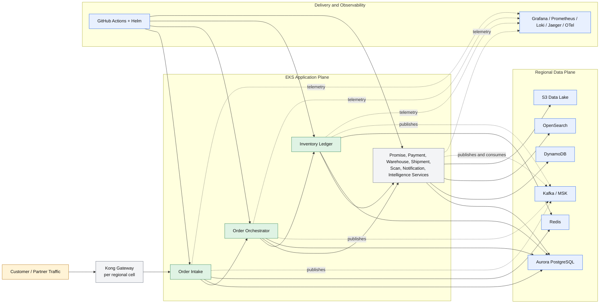
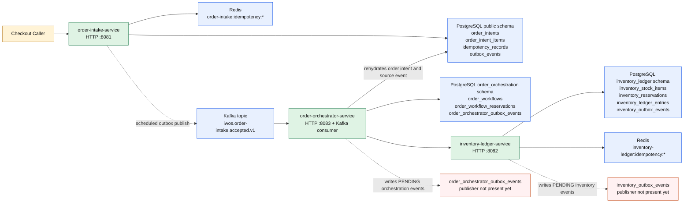

# IWOS Architecture HLD (Mermaid)

This document reflects the repository workspace on March 30, 2026.

It separates two things that currently coexist in the repo:

- the `target platform architecture` described by the service catalog and architecture docs
- the `implemented execution slice` that already has runnable Java code

## 1. Coverage Summary

| Scope | Status | Notes |
|---|---|---|
| `order-intake-service` | implemented | synchronous order acceptance, idempotency, outbox publisher |
| `order-orchestrator-service` | implemented | Kafka consumer, workflow persistence, inventory reservation orchestration |
| `inventory-ledger-service` | implemented | stock adjustment, reservation lifecycle, idempotent command handling |
| remaining service catalog entries | scaffolded | contracts, deployment files, and runtime configs exist but no Java execution path yet |
| platform modules | partial | `common-kernel`, `kafka-starter`, `observability-starter`, `service-testkit`, Kong, observability stack, Terraform skeletons |

## 2. Full Project Service Landscape

### Reading Notes

- The service map in the repository is broad and intentionally production-shaped.
- Only the three green services currently execute business logic.
- The rest of the boxes still matter architecturally because their contracts, deployment scaffolding, and domain boundaries are already present in the repo.

## 3. Target Regional Cell Runtime

### Reading Notes

- The canonical architecture is `fast accept + async orchestration`, not one synchronous end-to-end checkout.
- Regional cell boundaries keep hot-path state, Kafka, and fulfillment operations local.
- The repo already contains the AWS-facing deployment language for this model: Kong manifests, Helm charts, Terraform modules, and observability stack definitions.

## 4. Current Implemented Runtime Slice

### Current-State Findings

- `order-intake-service` now implements a real transactional outbox publisher to Kafka.
- `order-orchestrator-service` consumes Kafka, but it still rehydrates source order data by reading the `public` order-intake tables directly from PostgreSQL.
- `order-orchestrator-service` and `inventory-ledger-service` both persist outbox rows, but no publisher for those outbox tables exists in the current workspace.
- This means the current runtime is already event-driven at ingress, but still hybrid and DB-coupled downstream.
