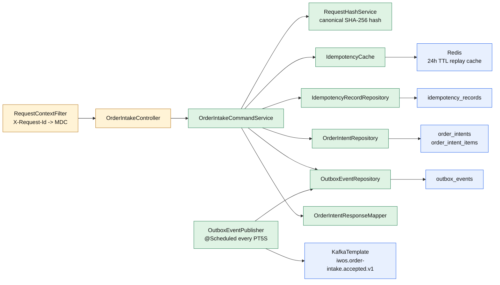
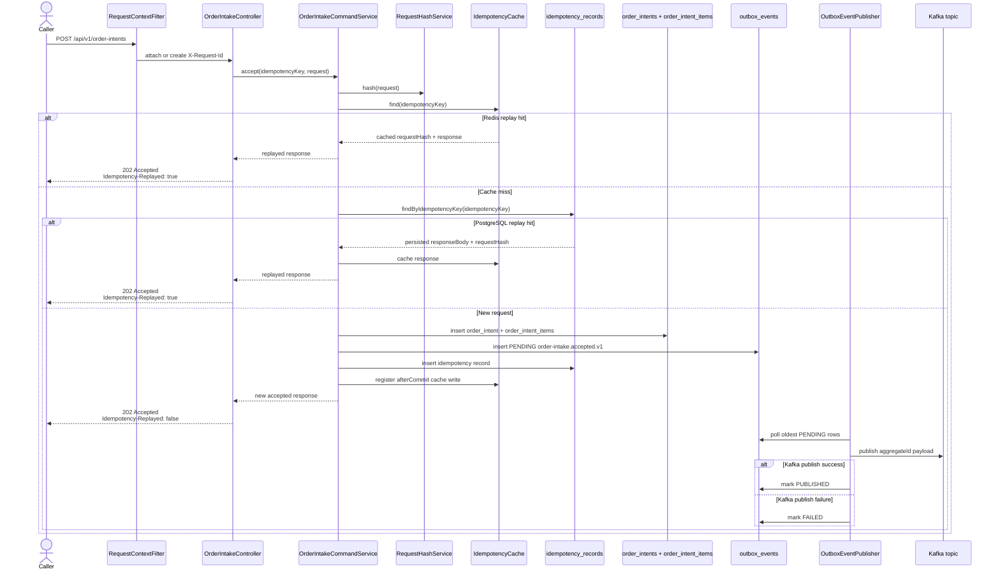
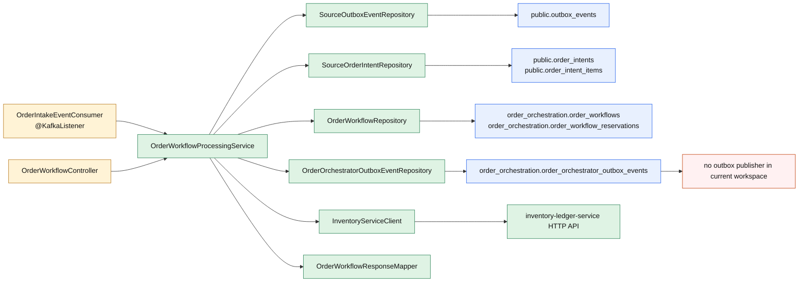
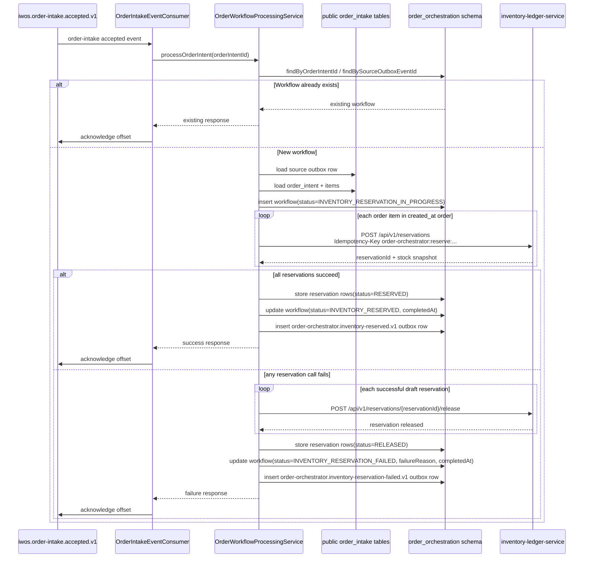
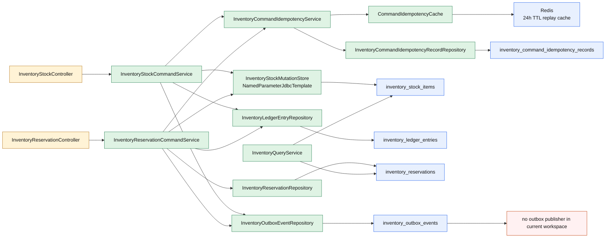
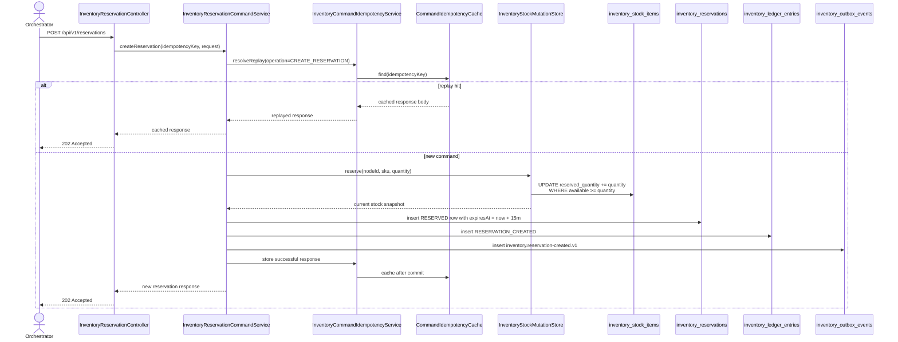
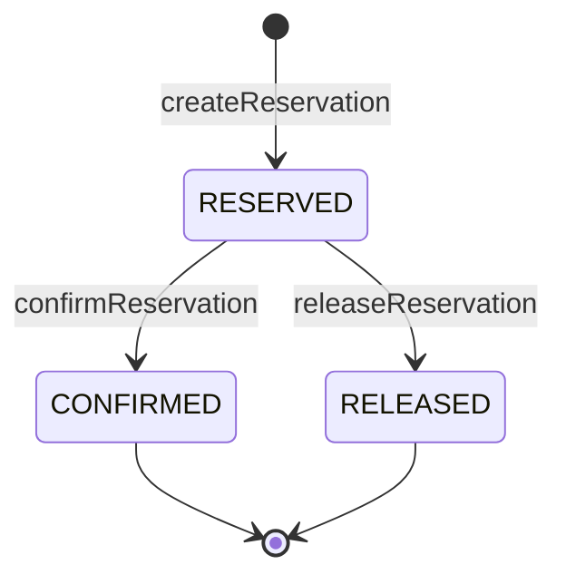
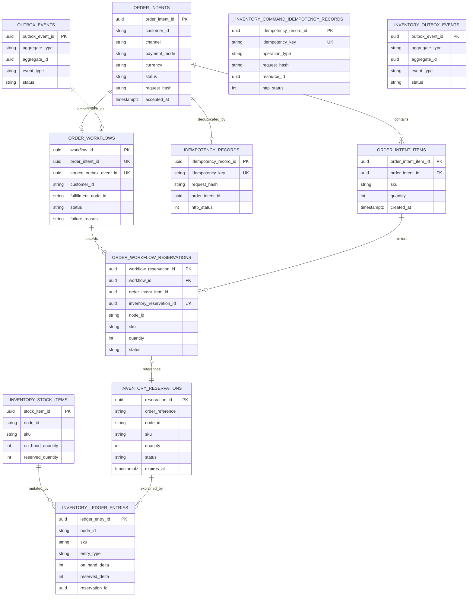

# IWOS Architecture LLD (Mermaid)

This document explains the internal working of the currently implemented execution path in the workspace on March 30, 2026.

Implemented services covered here:

- `order-intake-service`
- `order-orchestrator-service`
- `inventory-ledger-service`

Cross-cutting patterns already shared by these services:

- caller-supplied idempotency keys for write APIs
- `X-Request-Id` request correlation into MDC-backed logs
- PostgreSQL as transactional state
- Redis as the fast replay cache for idempotent commands
- outbox tables for downstream event publication

## 1. Order Intake Internal Components

### What This Service Owns

- fast synchronous order acceptance
- replay-safe deduplication across Redis and PostgreSQL
- normalized storage of order header, items, idempotency record, and accepted-event outbox row

## 2. Order Intake Request Flow

## 3. Order Orchestrator Internal Components

### What This Service Owns

- discovery of accepted orders to orchestrate
- workflow row creation and status tracking
- item-by-item inventory reservation
- compensation through release calls when a later item fails
- storage of downstream reservation references for each order item

## 4. Order Orchestration Flow

### Important Current-State Detail

The accepted Kafka event is not the full source of truth yet. The consumer uses the event only to locate the `orderIntentId`, then it rehydrates the full order from the order-intake tables in PostgreSQL.

## 5. Inventory Ledger Internal Components

### What This Service Owns

- atomic stock mutation per `(nodeId, sku)`
- reservation creation, confirmation, and release
- authoritative stock snapshot response generation
- ledger history for every adjustment and reservation transition
- idempotent write semantics across Redis and PostgreSQL

## 6. Inventory Reservation Command Flow

## 7. Inventory Reservation State Machine

### Command Effects By Transition

| Transition | Stock Effect | Ledger Entry | Outbox Event |
|---|---|---|---|
| create reservation | `reserved_quantity +n` | `RESERVATION_CREATED` | `inventory.reservation-created.v1` |
| confirm reservation | `on_hand -n`, `reserved -n` | `RESERVATION_CONFIRMED` | `inventory.reservation-confirmed.v1` |
| release reservation | `reserved -n` | `RESERVATION_RELEASED` | `inventory.reservation-released.v1` |

## 8. Core Data Model Across The Implemented Slice

### Schema Notes

- `order-intake-service` persists in the PostgreSQL `public` schema.
- `order-orchestrator-service` persists in the `order_orchestration` schema but still reads source data from `public`.
- `inventory-ledger-service` persists in the `inventory_ledger` schema.
- Several references are logical rather than DB-enforced foreign keys, especially around outbox rows and polymorphic idempotency `resource_id` values.
