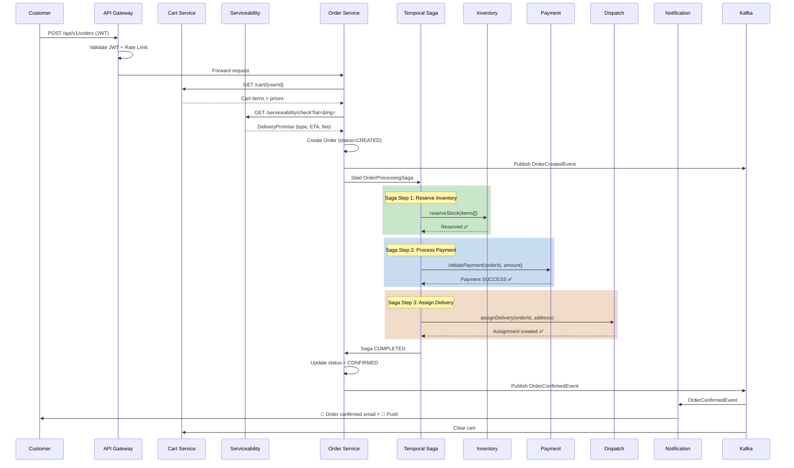
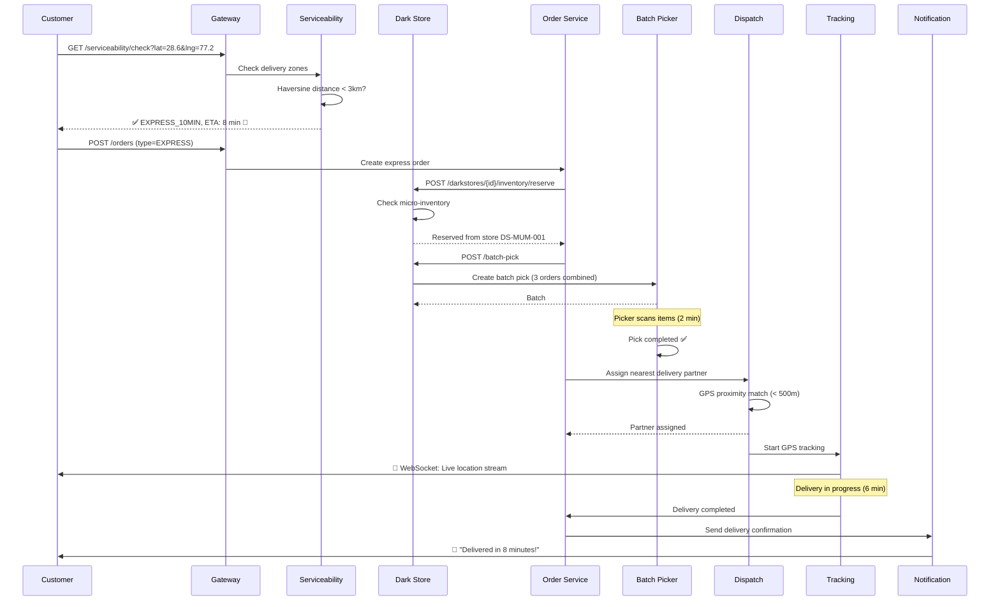
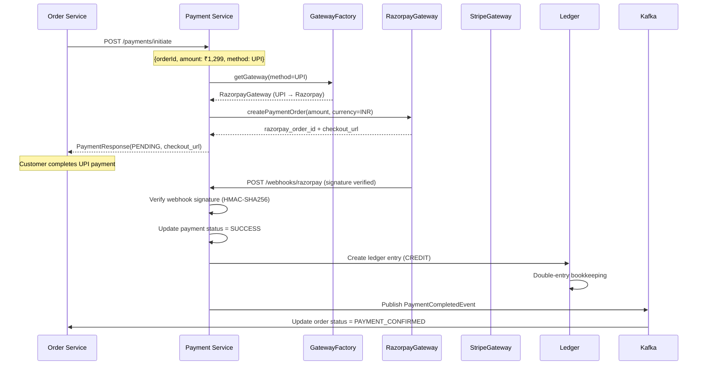
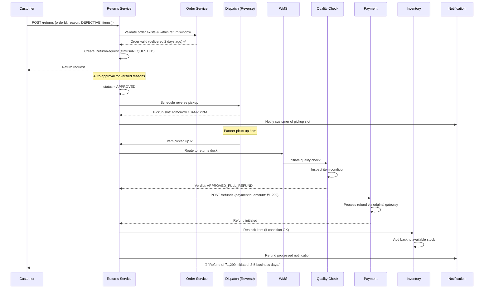
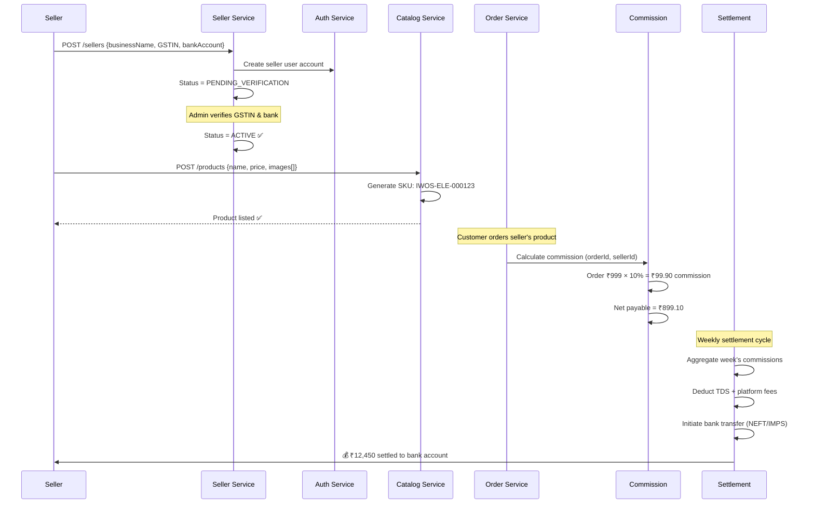

# 🔄 End-to-End Data Flows

## Flow 1: Customer Places an Order (Standard)

## Flow 2: Blinkit-Style 10-Minute Delivery

## Flow 3: Payment Processing (Strategy Pattern)

## Flow 4: Return & Refund Flow

## Flow 5: Seller Onboarding & Commission

