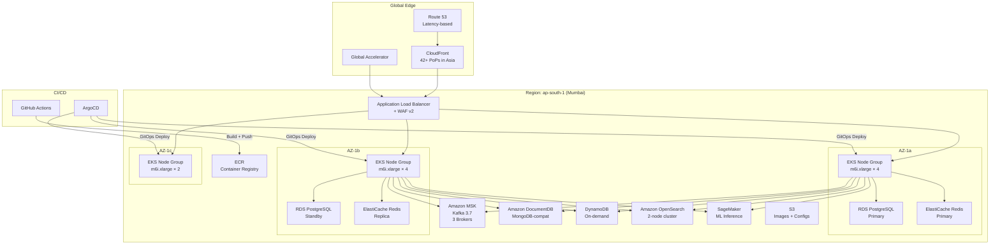
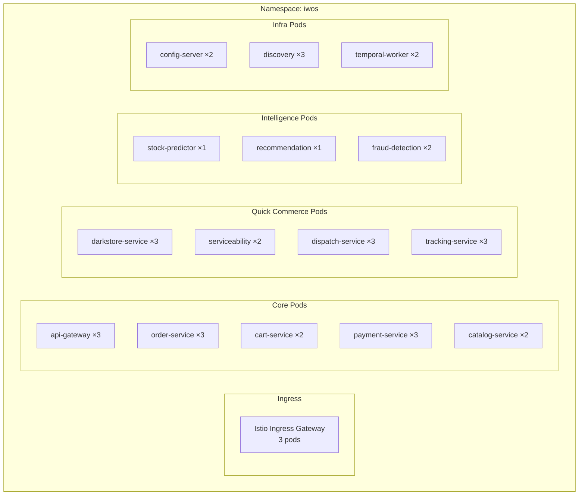

# 🚀 Deployment Architecture

## 1. AWS Infrastructure Overview

## 2. EKS Cluster Layout

## 3. Auto-Scaling Policy

| Service | Min Pods | Max Pods | Scale Trigger |
|---------|----------|----------|--------------|
| api-gateway | 3 | 15 | CPU > 60% |
| order-service | 3 | 20 | CPU > 70% or RPS > 500 |
| cart-service | 2 | 10 | CPU > 70% |
| payment-service | 3 | 15 | CPU > 60% |
| darkstore-service | 3 | 20 | CPU > 60% (peak during flash sales) |
| tracking-service | 3 | 25 | WebSocket connections > 1000 |
| dispatch-service | 3 | 15 | Queue depth > 100 |
| search-service | 2 | 10 | Avg latency > 200ms |

## 4. CI/CD Pipeline

```mermaid
graph LR
    subgraph "CI (GitHub Actions)"
        PR["Pull Request"] --> LINT["Checkstyle + SpotBugs"]
        LINT --> TEST["Unit + Integration Tests"]
        TEST --> BUILD["Maven Build"]
        BUILD --> DOCKER["Docker Build"]
        DOCKER --> PUSH["Push to ECR"]
        PUSH --> SCAN["Trivy Security Scan"]
    end
    
    subgraph "CD (ArgoCD)"
        SCAN --> MANIFEST["Update K8s Manifests"]
        MANIFEST --> ARGO["ArgoCD Sync"]
        ARGO --> DEV["Dev Cluster"]
        DEV -->|"manual gate"| STAGING["Staging"]
        STAGING -->|"canary 10%"| PROD["Production"]
    end
```

## 5. Database Deployment

| Service | Engine | Instance | Multi-AZ | Backup | Encryption |
|---------|--------|----------|----------|--------|------------|
| Auth, Order, Payment | RDS PostgreSQL 16 | db.r6g.large | ✅ | 7-day automated | AES-256 |
| Catalog, Inventory | RDS PostgreSQL 16 | db.r6g.medium | ✅ | 7-day automated | AES-256 |
| Reviews, Recommendations | DocumentDB | db.r6g.medium | ✅ | Continuous | AES-256 |
| Tracking | DynamoDB | On-demand | Global Tables | PITR | AES-256 |
| Cart, Sessions | ElastiCache Redis 7 | cache.r6g.large | ✅ | Daily | In-transit TLS |
| Product Search | OpenSearch | r6g.large.search ×2 | ✅ | Automated | AES-256 |

## 6. Cost Estimation (Monthly)

| Resource | Specification | Estimated Cost |
|----------|--------------|----------------|
| EKS Cluster | 10 × m6i.xlarge | $1,200 |
| RDS PostgreSQL | 3 × db.r6g.large (Multi-AZ) | $900 |
| ElastiCache Redis | 1 × cache.r6g.large (Multi-AZ) | $450 |
| MSK Kafka | 3 × kafka.m5.large | $600 |
| DocumentDB | 1 × db.r6g.medium | $250 |
| OpenSearch | 2 × r6g.large.search | $350 |
| DynamoDB | On-demand (estimated) | $100 |
| CloudFront | 500GB transfer | $50 |
| S3 | 100GB storage | $5 |
| SageMaker | 1 × ml.m5.xlarge (inference) | $200 |
| **Total** | | **~$4,100/month** |
