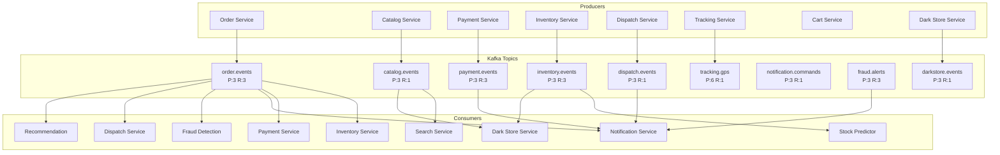
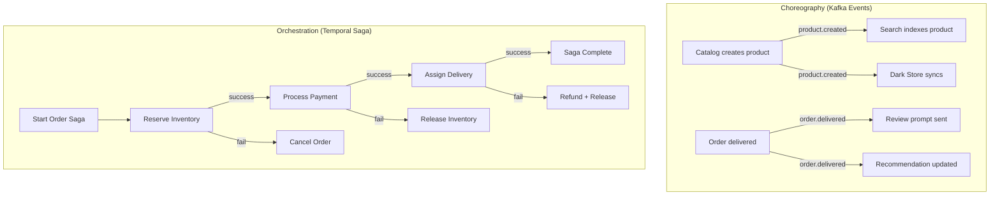

# 📨 Event-Driven Architecture

## 1. Kafka Topic Map



## 2. Event Schemas

### Order Events

| Event | Topic | Key | Trigger | Consumers |
|-------|-------|-----|---------|-----------|
| `OrderCreatedEvent` | order.events | orderId | New order placed | Inventory, Fraud, Notification |
| `OrderConfirmedEvent` | order.events | orderId | Payment successful | Dispatch, Notification |
| `OrderShippedEvent` | order.events | orderId | Picked up by delivery | Tracking, Notification |
| `OrderDeliveredEvent` | order.events | orderId | Delivered | Notification, Review (prompt) |
| `OrderCancelledEvent` | order.events | orderId | User/system cancel | Inventory (release), Payment (refund) |

### Catalog Events

| Event | Topic | Key | Trigger | Consumers |
|-------|-------|-----|---------|-----------|
| `ProductCreatedEvent` | catalog.events | productId | New product listed | Search (index), DarkStore |
| `ProductUpdatedEvent` | catalog.events | productId | Price/detail changed | Search (re-index) |
| `ProductDeletedEvent` | catalog.events | productId | Product delisted | Search (remove) |

### Payment Events

| Event | Topic | Key | Trigger | Consumers |
|-------|-------|-----|---------|-----------|
| `PaymentInitiatedEvent` | payment.events | paymentId | Checkout started | Fraud (scoring) |
| `PaymentCompletedEvent` | payment.events | paymentId | Gateway confirms | Order (confirm), Notification |
| `PaymentFailedEvent` | payment.events | paymentId | Gateway rejects | Order (cancel), Notification |
| `RefundCompletedEvent` | payment.events | paymentId | Refund processed | Notification |

### Inventory Events

| Event | Topic | Key | Trigger | Consumers |
|-------|-------|-----|---------|-----------|
| `StockReservedEvent` | inventory.events | skuCode | Order reservation | Order saga |
| `StockReleasedEvent` | inventory.events | skuCode | Order cancelled | Dark Store |
| `StockLowEvent` | inventory.events | skuCode | Below reorder level | Predictor, Dark Store |
| `StockReplenishedEvent` | inventory.events | skuCode | New stock received | Dark Store |

## 3. Choreography vs Orchestration



| Aspect | Choreography | Orchestration |
|--------|-------------|---------------|
| **Use when** | Independent reactions | Coordinated multi-step transactions |
| **Coupling** | Loose | Tighter (via orchestrator) |
| **Visibility** | Harder to trace | Full workflow visibility |
| **Compensation** | Complex | Built-in with Temporal |
| **Example** | Catalog → Search sync | Order → Reserve → Pay → Ship |

## 4. Guaranteed Delivery & Error Handling

```
Producer → Kafka (acks=all) → Consumer Group → Process → Commit offset

On failure:
  → Retry (exponential backoff, max 3 attempts)
  → Dead Letter Queue (DLQ topic: {topic}.dlq)
  → Alert via Notification service
  → Manual intervention dashboard
```

**Consumer Group IDs:**
- `order-service` — for payment events
- `inventory-service` — for order events
- `search-service` — for catalog events
- `notification-service` — for all notification-worthy events
- `fraud-service` — for transaction events
- `darkstore-service` — for inventory + catalog events
