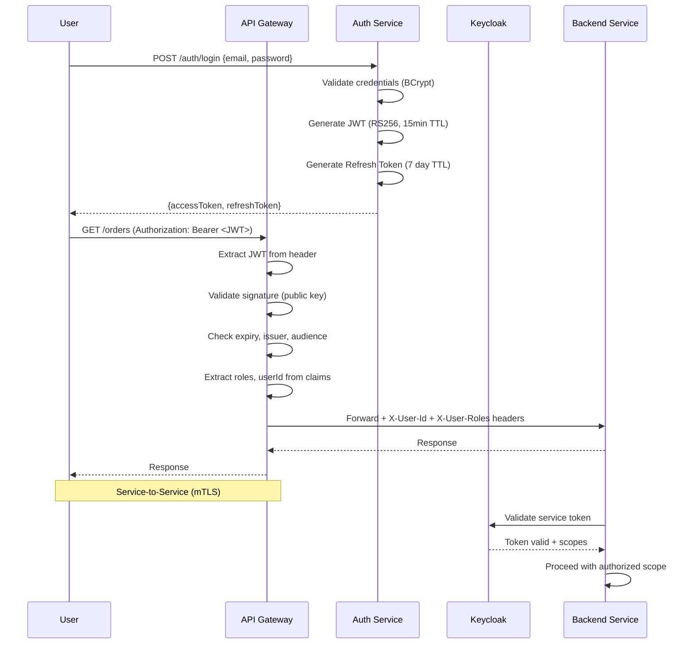
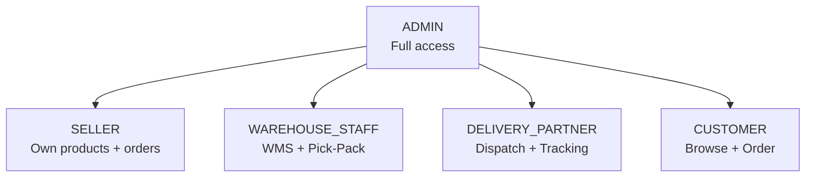
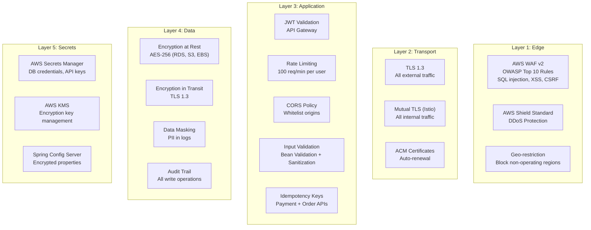

# 🔐 Security Architecture

## 1. Authentication & Authorization Flow



## 2. JWT Token Structure

```json
{
  "header": {
    "alg": "RS256",
    "typ": "JWT",
    "kid": "iwos-key-2024"
  },
  "payload": {
    "sub": "user-uuid-here",
    "email": "user@example.com",
    "roles": ["CUSTOMER"],
    "iss": "iwos-auth-service",
    "aud": "iwos-api",
    "iat": 1711440000,
    "exp": 1711440900,
    "jti": "unique-token-id"
  }
}
```

## 3. RBAC Role Hierarchy



| Role | Permissions |
|------|------------|
| CUSTOMER | Browse catalog, place orders, track, review, return |
| SELLER | List products, view own orders, settlements, analytics |
| WAREHOUSE_STAFF | WMS operations, pick-pack, inventory management |
| DELIVERY_PARTNER | View assignments, update delivery status, GPS tracking |
| ADMIN | Full access + user management + system configuration |

## 4. Security Layers



## 5. API Gateway Security Rules

| Rule | Configuration | Purpose |
|------|--------------|---------|
| JWT validation | RS256, 15min expiry | Authentication |
| Rate limiting | 100 req/min/user, 1000 req/min/IP | Abuse prevention |
| Request size limit | 10MB max body | DoS prevention |
| CORS | Whitelist origins | Cross-origin control |
| Circuit breaker | 50% failure threshold, 30s open | Cascade prevention |
| IP blacklist | Dynamic via WAF | Block bad actors |
| Header sanitization | Strip internal headers | Header injection |

## 6. Payment Security (PCI-DSS Compliance)

```
[Customer] → [Razorpay/Stripe Checkout] → [Payment Gateway Webhook]
                ↓                              ↓
         Card data NEVER touches          Signature verified
         our backend servers              (HMAC-SHA256)
                                              ↓
                                    [Payment Service records]
                                    [transaction metadata only]
```

- **No card data storage** — delegated to PCI-compliant gateways
- **Webhook signature verification** — HMAC-SHA256 with shared secret
- **Idempotency** — every payment request has a unique idempotency key
- **Double-entry ledger** — every transaction recorded with CREDIT/DEBIT
