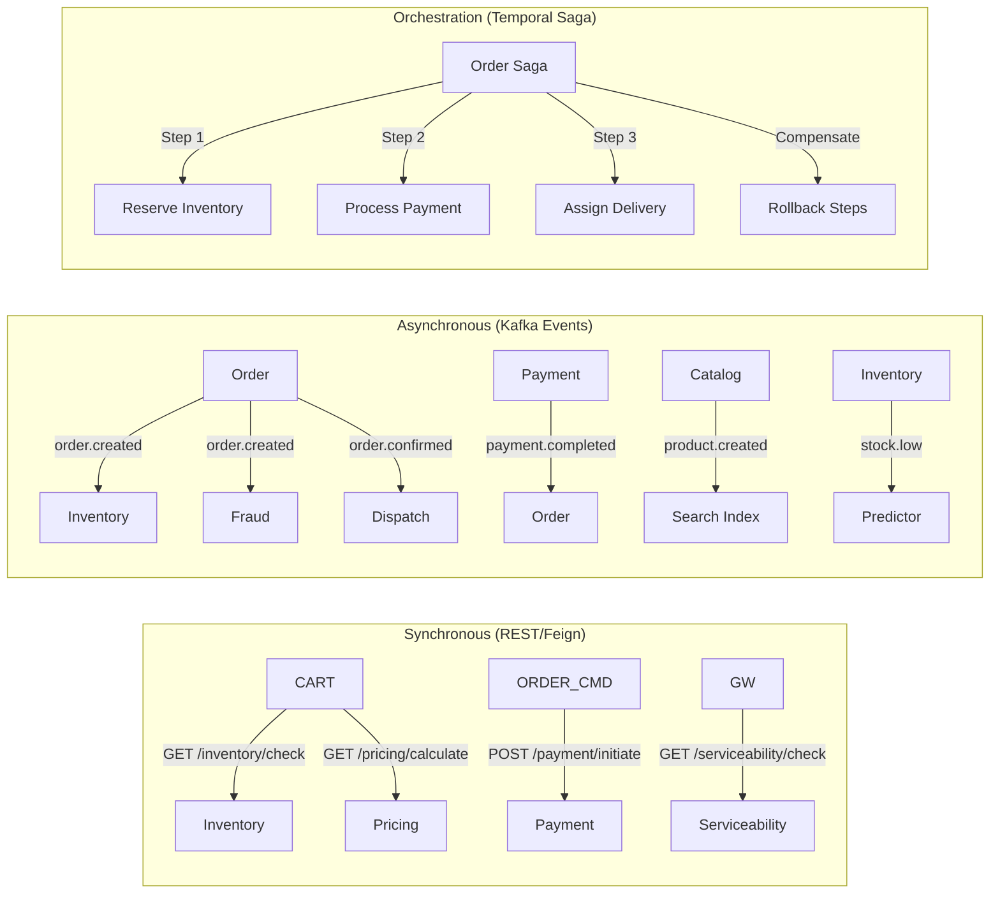
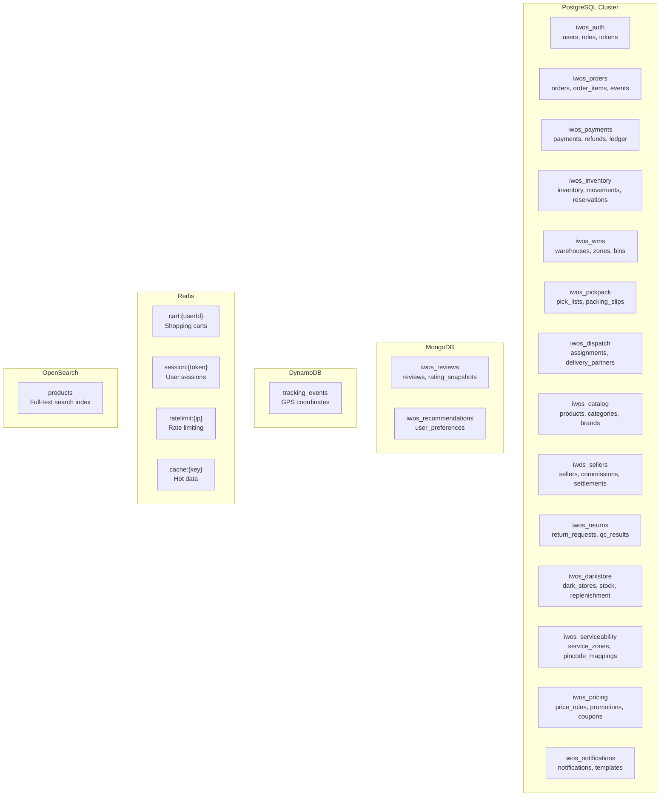
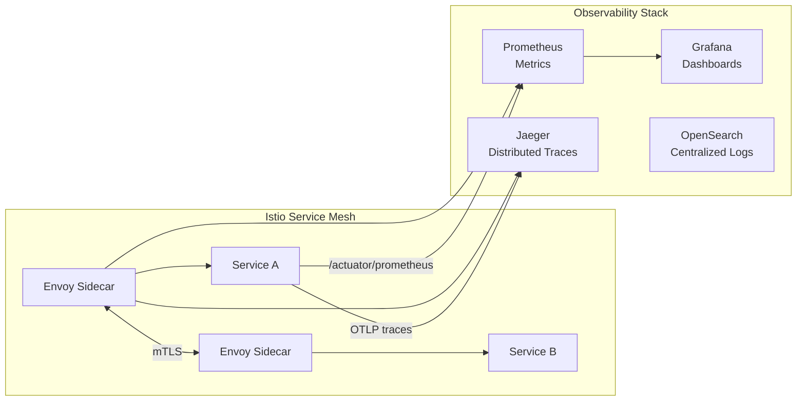

# 🏗️ IWOS System Architecture — High-Level Design

## 1. Architecture Overview

IWOS follows a **Domain-Driven Microservices Architecture** with 26 independently deployable services organized into 7 domains.

```mermaid
graph TB
    subgraph "Client Layer"
        WEB["🌐 Web App<br>React + Next.js"]
        SELLER["🏪 Seller Portal<br>React"]
        MOBILE["📱 Mobile App<br>React Native"]
        ADMIN["🔧 Admin Panel"]
    end

    subgraph "Edge Layer"
        CF["CloudFront CDN<br>42+ Asia PoPs"]
        WAF["AWS WAF v2<br>OWASP Rules"]
        R53["Route 53<br>Latency Routing"]
    end

    subgraph "Gateway Layer"
        GW["API Gateway<br>Spring Cloud Gateway<br>JWT • Rate Limit • Circuit Breaker"]
    end

    subgraph "Identity Domain"
        AUTH["Auth Service<br>:8081<br>JWT + Keycloak"]
    end

    subgraph "Marketplace Domain"
        CATALOG["Catalog Service<br>:8096<br>Products • Categories • SKU"]
        SEARCH["Search Service<br>:8097<br>OpenSearch • Autocomplete"]
        SELLER_SVC["Seller Service<br>:8098<br>Onboarding • Commission"]
        REVIEW["Review Service<br>:8100<br>Ratings • Moderation"]
    end

    subgraph "Core Commerce Domain"
        CART["Cart Service<br>:8083<br>Redis-backed"]
        ORDER["Order Service<br>:8082<br>CQRS + Event Sourcing"]
        PAY["Payment Service<br>:8084<br>Razorpay • Stripe"]
        RETURNS["Returns Service<br>:8099<br>RMA • Reverse Logistics"]
    end

    subgraph "Warehouse Domain"
        INV["Inventory Service<br>:8085<br>Stock • Reservations"]
        WMS["WMS Service<br>:8086<br>Zones • Bins"]
        PP["Pick-Pack Service<br>:8087<br>Wave Planning"]
        DS["Dark Store Service<br>:8101<br>🚀 10-min Delivery"]
    end

    subgraph "Delivery Domain"
        DISPATCH["Dispatch Service<br>:8088<br>Assignment Engine"]
        ROUTE["Route Optimizer<br>:8089<br>VRP • TSP"]
        TRACK["Tracking Service<br>:8090<br>GPS • WebSocket"]
        SVC["Serviceability<br>:8102<br>Geofence • ETA"]
    end

    subgraph "Intelligence Domain"
        PREDICT["Stock Predictor<br>:8091<br>SageMaker • DeepAR+"]
        RECOM["Recommendation<br>:8092<br>Collaborative Filter"]
        PRICE["Dynamic Pricing<br>:8093<br>Demand-based"]
        FRAUD["Fraud Detection<br>:8094<br>Real-time Scoring"]
    end

    subgraph "Notification Domain"
        NOTIF["Notification Service<br>:8095<br>SES • SNS • Push"]
    end

    subgraph "Infrastructure"
        CONFIG["Config Server<br>:8888"]
        EUREKA["Discovery Server<br>:8761"]
        KAFKA["Apache Kafka<br>Event Bus"]
        PG["PostgreSQL 16<br>Per-service DB"]
        REDIS["Redis 7<br>Cache + Sessions"]
        MONGO["MongoDB 7<br>Reviews • Recommendations"]
        DYNAMO["DynamoDB<br>GPS Tracking"]
        OS["OpenSearch 2.x<br>Full-text Search"]
        TEMPORAL["Temporal.io<br>Saga Orchestration"]
    end

    WEB & SELLER & MOBILE & ADMIN --> CF --> WAF --> R53 --> GW
    GW --> AUTH
    GW --> CATALOG & SEARCH & SELLER_SVC & REVIEW
    GW --> CART & ORDER & PAY & RETURNS
    GW --> INV & WMS & PP & DS
    GW --> DISPATCH & ROUTE & TRACK & SVC
    GW --> PREDICT & RECOM & PRICE & FRAUD
    GW --> NOTIF

    ORDER --> KAFKA
    KAFKA --> INV & PAY & DISPATCH & NOTIF & SEARCH & FRAUD
    
    CATALOG --> PG
    ORDER --> PG
    PAY --> PG
    INV --> PG
    AUTH --> PG
    DS --> PG
    CART --> REDIS
    SEARCH --> OS
    REVIEW --> MONGO
    RECOM --> MONGO
    TRACK --> DYNAMO
    ORDER --> TEMPORAL
```

## 2. Domain Decomposition

| Domain | Services | Database | Key Pattern |
|--------|----------|----------|-------------|
| **Identity** | Auth | PostgreSQL | OAuth2 + JWT |
| **Marketplace** | Catalog, Search, Seller, Review | PostgreSQL + OpenSearch + MongoDB | CQRS Read |
| **Core Commerce** | Order, Cart, Payment, Returns | PostgreSQL + Redis | CQRS + Event Sourcing + Saga |
| **Warehouse** | Inventory, WMS, Pick-Pack, Dark Store | PostgreSQL | Domain Events |
| **Delivery** | Dispatch, Route, Tracking, Serviceability | PostgreSQL + DynamoDB | Geo-spatial + WebSocket |
| **Intelligence** | Predictor, Recommendation, Pricing, Fraud | SageMaker + MongoDB | ML Pipeline + Rules Engine |
| **Cross-cutting** | Notification, Config, Discovery, Gateway | PostgreSQL | Strategy Pattern |

## 3. Communication Patterns

### Decision: When Sync vs Async?

| Use Sync (Feign) | Use Async (Kafka) | Use Saga (Temporal) |
|---|---|---|
| Real-time user-facing reads | Fire-and-forget side effects | Multi-step distributed transactions |
| Cart → Inventory availability | Order → Notification | Order → Reserve → Pay → Ship |
| Serviceability check | Catalog → Search index sync | Return → QC → Refund → Restock |
| Price calculation | Stock alerts | Payment → Settlement → Payout |

## 4. Data Isolation Strategy

**Database-per-service** with no shared schemas:

## 5. Resilience Patterns

| Pattern | Implementation | Where |
|---------|---------------|-------|
| **Circuit Breaker** | Resilience4j | API Gateway, Feign Clients |
| **Retry** | Spring Retry + Exponential Backoff | Kafka consumers, HTTP clients |
| **Bulkhead** | Thread pool isolation | Per-service Feign clients |
| **Rate Limiting** | Redis sliding window | API Gateway (global) |
| **Saga Compensation** | Temporal workflows | Order processing |
| **Fallback** | Cached/default responses | Search, Recommendations |
| **Idempotency** | Idempotency keys in DB | Payment, Order creation |
| **Dead Letter Queue** | Kafka DLQ topics | All event consumers |

## 6. Service Mesh & Observability

