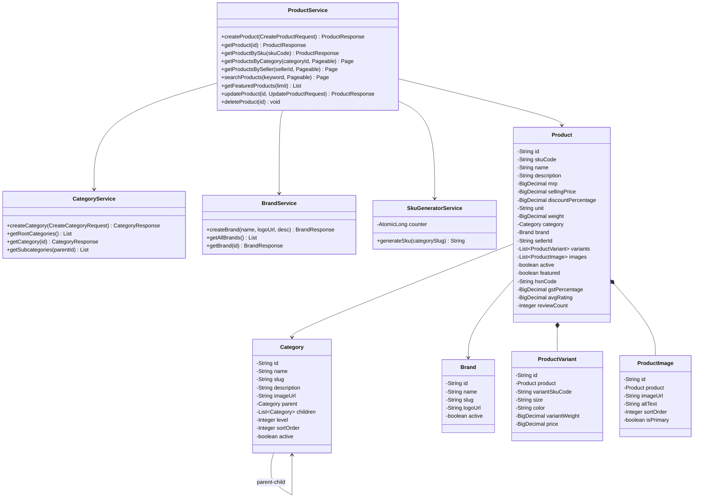
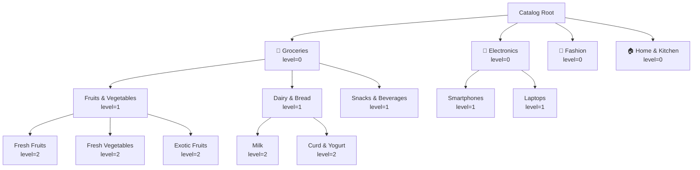
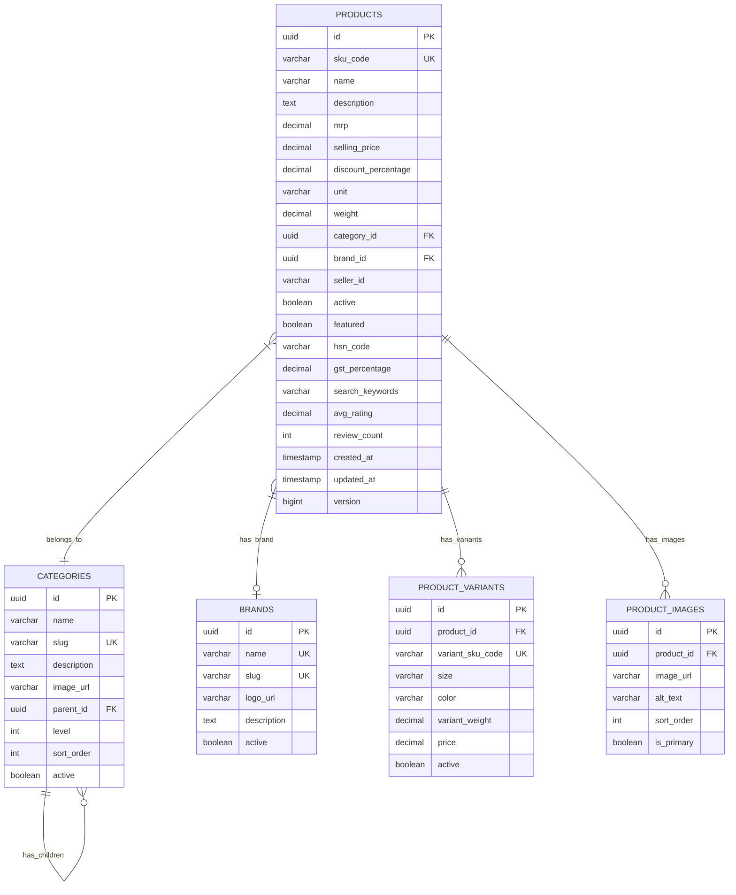
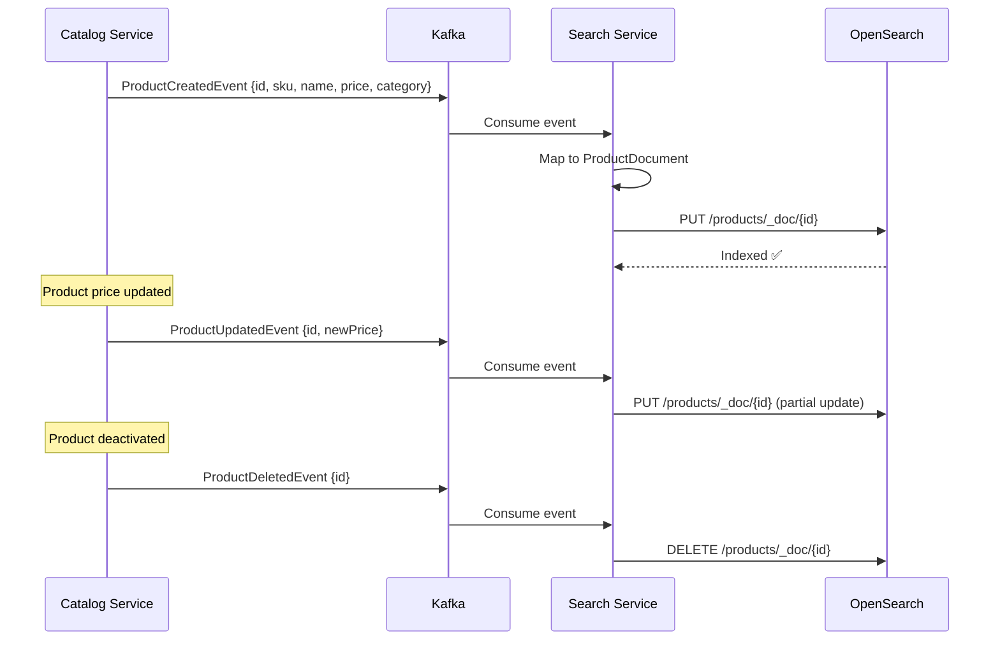

# 📒 Catalog Service — Low-Level Design

## 1. Class Diagram



## 2. Category Hierarchy (Self-Referencing Tree)



## 3. SKU Generation

```
Format: IWOS-{CATEGORY_PREFIX}-{SEQUENCE}

Examples:
  IWOS-FRU-000001   → Fruits category, 1st product
  IWOS-ELE-000042   → Electronics, 42nd product
  IWOS-DAI-000007   → Dairy, 7th product

Category prefix: First 3 chars of category slug (uppercase)
Sequence: AtomicLong counter (thread-safe)
```

## 4. ER Diagram



## 5. Search Index Sync (Catalog → OpenSearch)


