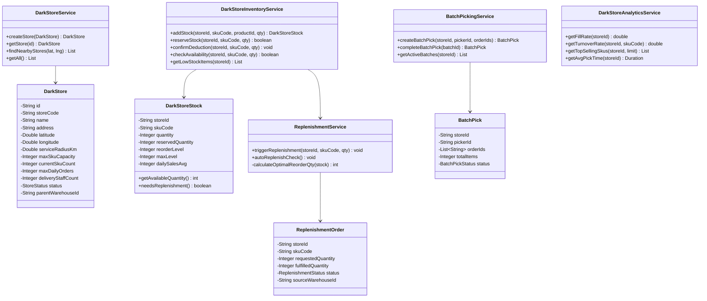
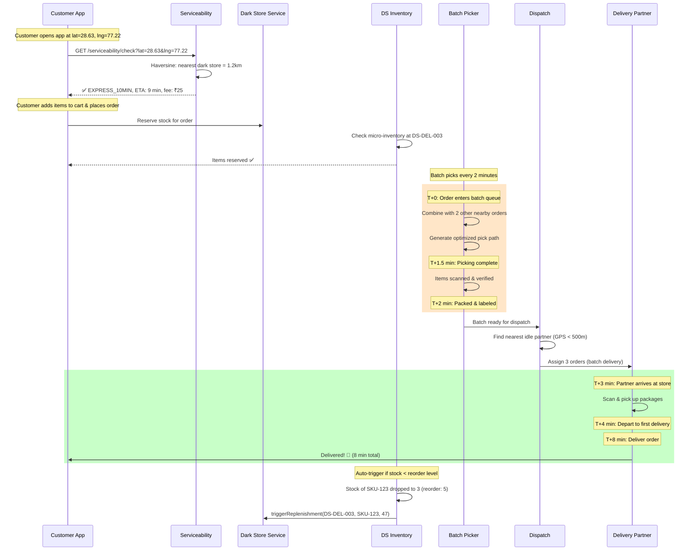
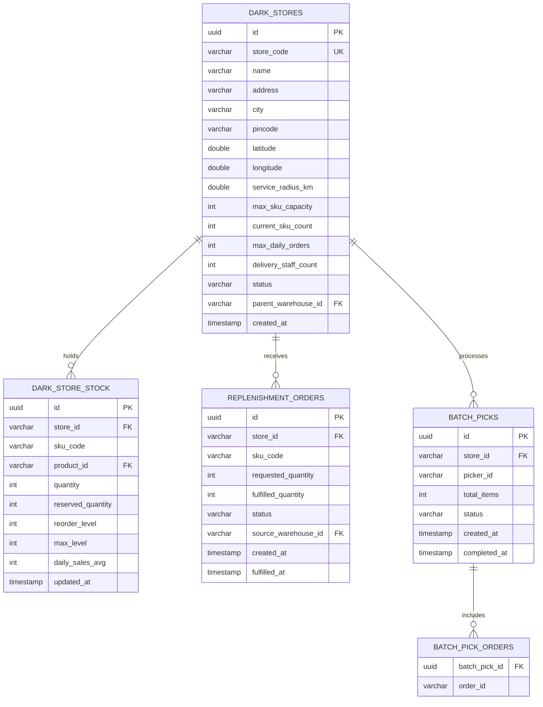

# 🏪 Dark Store Service — Low-Level Design (Blinkit Model)

## 1. What is a Dark Store?

A **dark store** is a micro-fulfillment center (typically 2,000-3,000 sq ft) that serves a 2-4 km radius with **10-minute delivery**. Unlike a regular warehouse, it:
- Has no walk-in customers
- Stocks only ~2,000 high-velocity SKUs
- Uses batch picking (multiple orders at once)
- Auto-replenishes from a parent warehouse

## 2. Class Diagram



## 3. 10-Minute Delivery Flow



## 4. Auto-Replenishment Algorithm

```
Every 5 minutes:
  FOR each active dark_store:
    FOR each low_stock item (available <= reorder_level):
      optimal_qty = max_level - current_quantity
      IF no pending replenishment for this SKU:
        CREATE replenishment_order(
          store_id: store,
          sku_code: item.sku,
          quantity: optimal_qty,
          source: store.parent_warehouse_id,
          priority: item.daily_sales_avg > 20 ? HIGH : NORMAL
        )
        PUBLISH event: darkstore.replenishment.requested
```

## 5. ER Diagram



## 6. Key Metrics

| Metric | Target | Measurement |
|--------|--------|-------------|
| **Time to pick** | < 2 min | Batch pick start → complete |
| **Fill rate** | > 95% | Items available / items requested |
| **Avg delivery time** | < 10 min | Order placed → delivered |
| **Stock turnover** | 2-3x/week | Sales / avg inventory |
| **Replenishment SLA** | < 4 hours | Order → received at dark store |
