# 🗄️ Database Schema — All Services

## Complete ER Diagram (Cross-Service)

```mermaid
erDiagram
    %% AUTH
    USERS {
        uuid id PK
        varchar email UK
        varchar password_hash
        varchar first_name
        varchar last_name
        varchar phone
        boolean enabled
        boolean email_verified
        timestamp created_at
    }
    ROLES {
        uuid id PK
        varchar name UK
    }
    USER_ROLES {
        uuid user_id FK
        uuid role_id FK
    }
    REFRESH_TOKENS {
        uuid id PK
        varchar token UK
        uuid user_id FK
        timestamp expiry_date
        boolean revoked
    }
    USERS ||--o{ USER_ROLES : has
    ROLES ||--o{ USER_ROLES : assigned_to
    USERS ||--o{ REFRESH_TOKENS : holds

    %% CATALOG
    PRODUCTS {
        uuid id PK
        varchar sku_code UK
        varchar name
        decimal mrp
        decimal selling_price
        uuid category_id FK
        uuid brand_id FK
        varchar seller_id
        boolean active
    }
    CATEGORIES {
        uuid id PK
        varchar slug UK
        varchar name
        uuid parent_id FK
        int level
    }
    BRANDS {
        uuid id PK
        varchar name UK
        varchar slug UK
    }
    PRODUCTS }|--|| CATEGORIES : belongs_to
    PRODUCTS }|--o| BRANDS : has

    %% ORDERS
    ORDERS {
        uuid id PK
        varchar user_id
        varchar status
        decimal total_amount
        decimal delivery_fee
        varchar payment_id
        varchar delivery_type
        timestamp created_at
    }
    ORDER_ITEMS {
        uuid id PK
        uuid order_id FK
        varchar sku_code
        int quantity
        decimal unit_price
        decimal subtotal
    }
    ORDERS ||--o{ ORDER_ITEMS : contains

    %% PAYMENTS
    PAYMENTS {
        uuid id PK
        varchar order_id
        decimal amount
        varchar method
        varchar status
        varchar gateway_order_id
        varchar idempotency_key UK
    }
    REFUNDS {
        uuid id PK
        uuid payment_id FK
        decimal amount
        varchar status
    }
    LEDGER {
        uuid id PK
        varchar entity_id
        varchar type
        decimal amount
        decimal balance_after
    }
    PAYMENTS ||--o{ REFUNDS : has
    PAYMENTS ||--o{ LEDGER : records

    %% INVENTORY
    INVENTORY {
        uuid id PK
        varchar sku_code UK
        varchar warehouse_id
        int total_quantity
        int reserved_quantity
        int reorder_level
    }
    STOCK_MOVEMENTS {
        uuid id PK
        varchar sku_code
        varchar type
        int quantity
        varchar reference_id
        timestamp created_at
    }

    %% SELLERS
    SELLERS {
        uuid id PK
        varchar user_id
        varchar business_name
        varchar gstin UK
        varchar status
        double commission_rate
    }
    COMMISSIONS {
        uuid id PK
        varchar seller_id FK
        varchar order_id
        decimal order_amount
        decimal commission_amount
    }
    SETTLEMENTS {
        uuid id PK
        varchar seller_id FK
        decimal net_payable
        varchar status
    }
    SELLERS ||--o{ COMMISSIONS : earns
    SELLERS ||--o{ SETTLEMENTS : receives

    %% DARK STORES
    DARK_STORES {
        uuid id PK
        varchar store_code UK
        varchar name
        double latitude
        double longitude
        double service_radius_km
        int max_sku_capacity
        varchar status
    }
    DS_STOCK {
        uuid id PK
        varchar store_id FK
        varchar sku_code
        int quantity
        int reserved_quantity
        int reorder_level
    }
    DARK_STORES ||--o{ DS_STOCK : holds

    %% RETURNS
    RETURN_REQUESTS {
        uuid id PK
        varchar order_id
        varchar user_id
        varchar reason
        varchar status
        decimal refund_amount
    }
    RETURN_ITEMS {
        uuid id PK
        uuid return_id FK
        varchar sku_code
        int quantity
    }
    RETURN_REQUESTS ||--o{ RETURN_ITEMS : contains

    %% SERVICEABILITY
    SERVICE_ZONES {
        uuid id PK
        varchar zone_name
        double center_lat
        double center_lng
        double radius_km
        varchar delivery_type
        varchar dark_store_id
    }
    PINCODE_MAPPINGS {
        uuid id PK
        varchar pincode
        varchar city
        varchar state
        boolean serviceable
        int estimated_hours
    }
```

## Database Summary

| Service | Database | Engine | Key Tables | Est. Rows (1yr) |
|---------|----------|--------|------------|-----------------|
| Auth | `iwos_auth` | PostgreSQL | users, roles, refresh_tokens | 1M users |
| Catalog | `iwos_catalog` | PostgreSQL | products, categories, brands | 100K products |
| Orders | `iwos_orders` | PostgreSQL | orders, items, events | 5M orders |
| Payments | `iwos_payments` | PostgreSQL | payments, refunds, ledger | 5M transactions |
| Inventory | `iwos_inventory` | PostgreSQL | inventory, movements, reservations | 500K SKUs |
| WMS | `iwos_wms` | PostgreSQL | warehouses, zones, bins | 10K bins |
| Pick-Pack | `iwos_pickpack` | PostgreSQL | pick_lists, packing_slips | 2M picks |
| Dispatch | `iwos_dispatch` | PostgreSQL | assignments, delivery_partners | 3M deliveries |
| Sellers | `iwos_sellers` | PostgreSQL | sellers, commissions, settlements | 50K sellers |
| Returns | `iwos_returns` | PostgreSQL | return_requests, qc_results | 500K returns |
| Dark Store | `iwos_darkstore` | PostgreSQL | dark_stores, stock, replenishment | 200 stores |
| Pricing | `iwos_pricing` | PostgreSQL | price_rules, promotions, coupons | 10K rules |
| Notification | `iwos_notifications` | PostgreSQL | notifications, templates | 20M notifications |
| Serviceability | `iwos_serviceability` | PostgreSQL | zones, pincode_mappings | 30K pincodes |
| Reviews | `iwos_reviews` | MongoDB | reviews, rating_snapshots | 2M reviews |
| Recommendations | `iwos_recommendations` | MongoDB | user_preferences | 1M profiles |
| Tracking | DynamoDB | DynamoDB | tracking_events | 50M GPS points |
