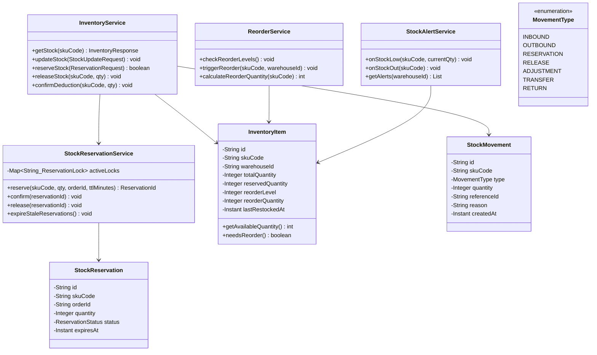
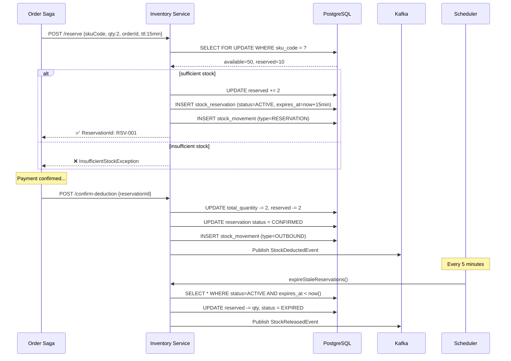
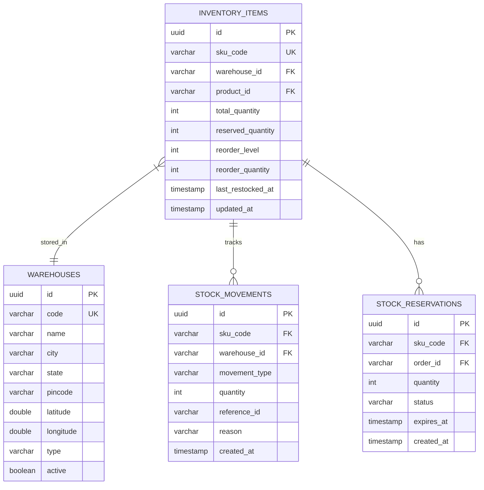

# 📦 Inventory Service — Low-Level Design

## 1. Class Diagram

```mermaid
classDiagram
    class InventoryService {
        +getStock(skuCode) InventoryResponse
        +updateStock(StockUpdateRequest) void
        +reserveStock(ReservationRequest) boolean
        +releaseStock(skuCode, qty) void
        +confirmDeduction(skuCode, qty) void
    }

    class StockReservationService {
        -Map~String_ReservationLock~ activeLocks
        +reserve(skuCode, qty, orderId, ttlMinutes) ReservationId
        +confirm(reservationId) void
        +release(reservationId) void
        +expireStaleReservations() void
    }

    class ReorderService {
        +checkReorderLevels() void
        +triggerReorder(skuCode, warehouseId) void
        +calculateReorderQuantity(skuCode) int
    }

    class StockAlertService {
        +onStockLow(skuCode, currentQty) void
        +onStockOut(skuCode) void
        +getAlerts(warehouseId) List
    }

    class InventoryItem {
        -String id
        -String skuCode
        -String warehouseId
        -Integer totalQuantity
        -Integer reservedQuantity
        -Integer reorderLevel
        -Integer reorderQuantity
        -Instant lastRestockedAt
        +getAvailableQuantity() int
        +needsReorder() boolean
    }

    class StockMovement {
        -String id
        -String skuCode
        -MovementType type
        -Integer quantity
        -String referenceId
        -String reason
        -Instant createdAt
    }

    class StockReservation {
        -String id
        -String skuCode
        -String orderId
        -Integer quantity
        -ReservationStatus status
        -Instant expiresAt
    }

    class MovementType {
        <<enumeration>>
        INBOUND
        OUTBOUND
        RESERVATION
        RELEASE
        ADJUSTMENT
        TRANSFER
        RETURN
    }

    InventoryService --> InventoryItem
    InventoryService --> StockReservationService
    StockReservationService --> StockReservation
    InventoryService --> StockMovement
    ReorderService --> InventoryItem
    StockAlertService --> InventoryItem
```

## 2. Stock Reservation Flow

```mermaid
sequenceDiagram
    participant ORD as Order Saga
    participant INV as Inventory Service
    participant DB as PostgreSQL
    participant KAFKA as Kafka
    participant SCHED as Scheduler

    ORD->>INV: POST /reserve {skuCode, qty:2, orderId, ttl:15min}
    INV->>DB: SELECT FOR UPDATE WHERE sku_code = ?
    DB-->>INV: available=50, reserved=10

    alt sufficient stock
        INV->>DB: UPDATE reserved += 2
        INV->>DB: INSERT stock_reservation (status=ACTIVE, expires_at=now+15min)
        INV->>DB: INSERT stock_movement (type=RESERVATION)
        INV-->>ORD: ✅ ReservationId: RSV-001
    else insufficient stock
        INV-->>ORD: ❌ InsufficientStockException
    end

    Note over ORD: Payment confirmed...
    ORD->>INV: POST /confirm-deduction {reservationId}
    INV->>DB: UPDATE total_quantity -= 2, reserved -= 2
    INV->>DB: UPDATE reservation status = CONFIRMED
    INV->>DB: INSERT stock_movement (type=OUTBOUND)
    INV->>KAFKA: Publish StockDeductedEvent

    Note over SCHED: Every 5 minutes
    SCHED->>INV: expireStaleReservations()
    INV->>DB: SELECT * WHERE status=ACTIVE AND expires_at < now()
    INV->>DB: UPDATE reserved -= qty, status = EXPIRED
    INV->>KAFKA: Publish StockReleasedEvent
```

## 3. ER Diagram

```mermaid
erDiagram
    INVENTORY_ITEMS {
        uuid id PK
        varchar sku_code UK
        varchar warehouse_id FK
        varchar product_id FK
        int total_quantity
        int reserved_quantity
        int reorder_level
        int reorder_quantity
        timestamp last_restocked_at
        timestamp updated_at
    }

    STOCK_MOVEMENTS {
        uuid id PK
        varchar sku_code FK
        varchar warehouse_id FK
        varchar movement_type
        int quantity
        varchar reference_id
        varchar reason
        timestamp created_at
    }

    STOCK_RESERVATIONS {
        uuid id PK
        varchar sku_code FK
        varchar order_id FK
        int quantity
        varchar status
        timestamp expires_at
        timestamp created_at
    }

    WAREHOUSES {
        uuid id PK
        varchar code UK
        varchar name
        varchar city
        varchar state
        varchar pincode
        double latitude
        double longitude
        varchar type
        boolean active
    }

    INVENTORY_ITEMS }|--|| WAREHOUSES : stored_in
    INVENTORY_ITEMS ||--o{ STOCK_MOVEMENTS : tracks
    INVENTORY_ITEMS ||--o{ STOCK_RESERVATIONS : has
```
