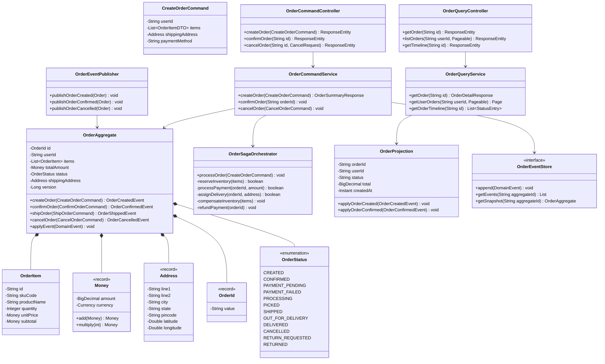
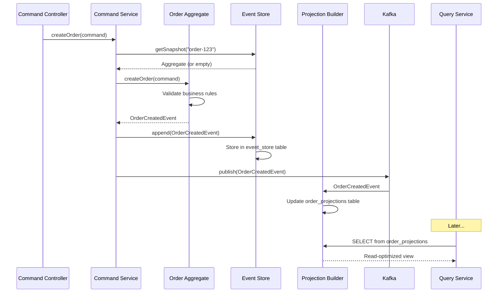
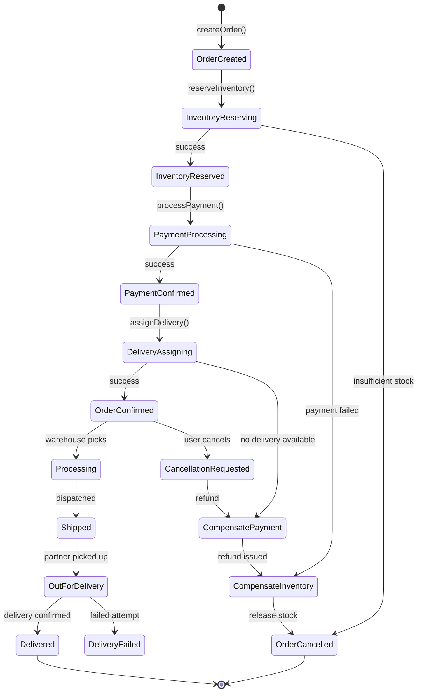
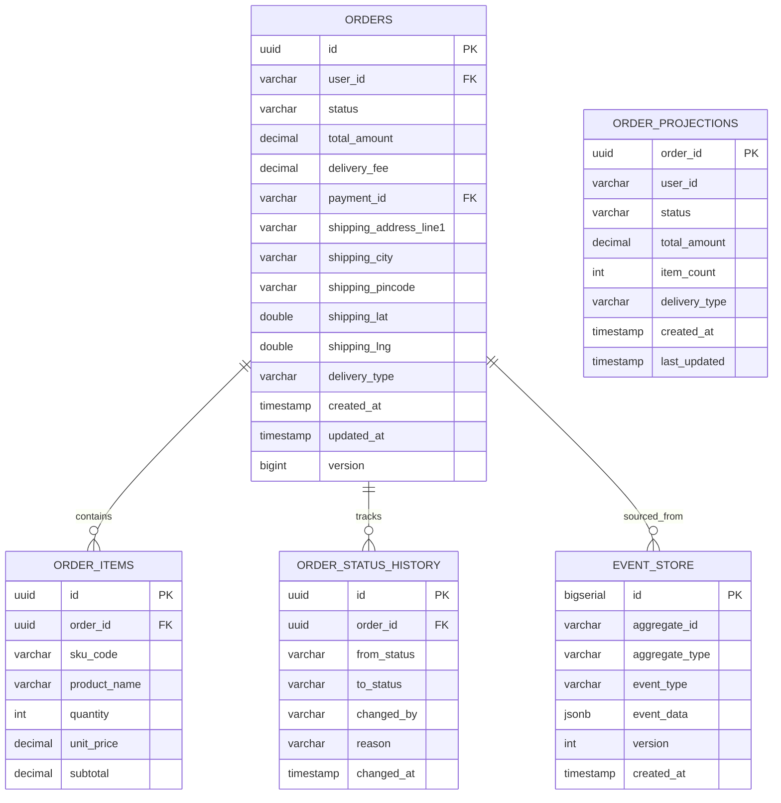

# 📦 Order Service — Low-Level Design

## 1. Class Diagram (CQRS Architecture)

```mermaid
classDiagram
    class OrderAggregate {
        -OrderId id
        -String userId
        -List~OrderItem~ items
        -Money totalAmount
        -OrderStatus status
        -Address shippingAddress
        -Long version
        +createOrder(CreateOrderCommand) OrderCreatedEvent
        +confirmOrder(ConfirmOrderCommand) OrderConfirmedEvent
        +shipOrder(ShipOrderCommand) OrderShippedEvent
        +cancelOrder(CancelOrderCommand) OrderCancelledEvent
        +applyEvent(DomainEvent) void
    }

    class OrderItem {
        -String id
        -String skuCode
        -String productName
        -Integer quantity
        -Money unitPrice
        -Money subtotal
    }

    class Money {
        <<record>>
        -BigDecimal amount
        -Currency currency
        +add(Money) Money
        +multiply(int) Money
    }

    class Address {
        <<record>>
        -String line1
        -String line2
        -String city
        -String state
        -String pincode
        -Double latitude
        -Double longitude
    }

    class OrderId {
        <<record>>
        -String value
    }

    class OrderStatus {
        <<enumeration>>
        CREATED
        CONFIRMED
        PAYMENT_PENDING
        PAYMENT_FAILED
        PROCESSING
        PICKED
        SHIPPED
        OUT_FOR_DELIVERY
        DELIVERED
        CANCELLED
        RETURN_REQUESTED
        RETURNED
    }

    class CreateOrderCommand {
        -String userId
        -List~OrderItemDTO~ items
        -Address shippingAddress
        -String paymentMethod
    }

    class OrderCommandService {
        +createOrder(CreateOrderCommand) OrderSummaryResponse
        +confirmOrder(String orderId) void
        +cancelOrder(CancelOrderCommand) void
    }

    class OrderQueryService {
        +getOrder(String id) OrderDetailResponse
        +getUserOrders(String userId, Pageable) Page
        +getOrderTimeline(String id) List~StatusEntry~
    }

    class OrderSagaOrchestrator {
        +processOrder(CreateOrderCommand) void
        -reserveInventory(items) boolean
        -processPayment(orderId, amount) boolean
        -assignDelivery(orderId, address) boolean
        -compensateInventory(items) void
        -refundPayment(orderId) void
    }

    class OrderCommandController {
        +createOrder(CreateOrderCommand) ResponseEntity
        +confirmOrder(String id) ResponseEntity
        +cancelOrder(String id, CancelRequest) ResponseEntity
    }

    class OrderQueryController {
        +getOrder(String id) ResponseEntity
        +listOrders(String userId, Pageable) ResponseEntity
        +getTimeline(String id) ResponseEntity
    }

    class OrderProjection {
        -String orderId
        -String userId
        -String status
        -BigDecimal total
        -Instant createdAt
        +applyOrderCreated(OrderCreatedEvent) void
        +applyOrderConfirmed(OrderConfirmedEvent) void
    }

    class OrderEventStore {
        <<interface>>
        +append(DomainEvent) void
        +getEvents(String aggregateId) List
        +getSnapshot(String aggregateId) OrderAggregate
    }

    class OrderEventPublisher {
        +publishOrderCreated(Order) void
        +publishOrderConfirmed(Order) void
        +publishOrderCancelled(Order) void
    }

    OrderAggregate *-- OrderItem
    OrderAggregate *-- Money
    OrderAggregate *-- Address
    OrderAggregate *-- OrderId
    OrderAggregate *-- OrderStatus
    OrderCommandService --> OrderAggregate
    OrderCommandService --> OrderSagaOrchestrator
    OrderCommandService --> OrderEventStore
    OrderQueryService --> OrderProjection
    OrderCommandController --> OrderCommandService
    OrderQueryController --> OrderQueryService
    OrderEventPublisher --> OrderAggregate
```

## 2. Event Sourcing Sequence

```mermaid
sequenceDiagram
    participant CMD as Command Controller
    participant SVC as Command Service
    participant AGG as Order Aggregate
    participant ES as Event Store
    participant PROJ as Projection Builder
    participant KAFKA as Kafka
    participant QRY as Query Service

    CMD->>SVC: createOrder(command)
    SVC->>ES: getSnapshot("order-123")
    ES-->>SVC: Aggregate (or empty)
    SVC->>AGG: createOrder(command)
    AGG->>AGG: Validate business rules
    AGG-->>SVC: OrderCreatedEvent

    SVC->>ES: append(OrderCreatedEvent)
    ES->>ES: Store in event_store table

    SVC->>KAFKA: publish(OrderCreatedEvent)

    KAFKA->>PROJ: OrderCreatedEvent
    PROJ->>PROJ: Update order_projections table
    
    Note over QRY: Later...
    QRY->>PROJ: SELECT from order_projections
    PROJ-->>QRY: Read-optimized view
```

## 3. Saga State Machine

```mermaid
stateDiagram-v2
    [*] --> OrderCreated: createOrder()
    OrderCreated --> InventoryReserving: reserveInventory()
    InventoryReserving --> InventoryReserved: success
    InventoryReserving --> OrderCancelled: insufficient stock

    InventoryReserved --> PaymentProcessing: processPayment()
    PaymentProcessing --> PaymentConfirmed: success
    PaymentProcessing --> CompensateInventory: payment failed
    CompensateInventory --> OrderCancelled: release stock

    PaymentConfirmed --> DeliveryAssigning: assignDelivery()
    DeliveryAssigning --> OrderConfirmed: success
    DeliveryAssigning --> CompensatePayment: no delivery available
    CompensatePayment --> CompensateInventory: refund issued

    OrderConfirmed --> Processing: warehouse picks
    Processing --> Shipped: dispatched
    Shipped --> OutForDelivery: partner picked up
    OutForDelivery --> Delivered: delivery confirmed
    OutForDelivery --> DeliveryFailed: failed attempt

    OrderConfirmed --> CancellationRequested: user cancels
    CancellationRequested --> CompensatePayment: refund

    Delivered --> [*]
    OrderCancelled --> [*]
```

## 4. ER Diagram

```mermaid
erDiagram
    ORDERS {
        uuid id PK
        varchar user_id FK
        varchar status
        decimal total_amount
        decimal delivery_fee
        varchar payment_id FK
        varchar shipping_address_line1
        varchar shipping_city
        varchar shipping_pincode
        double shipping_lat
        double shipping_lng
        varchar delivery_type
        timestamp created_at
        timestamp updated_at
        bigint version
    }

    ORDER_ITEMS {
        uuid id PK
        uuid order_id FK
        varchar sku_code
        varchar product_name
        int quantity
        decimal unit_price
        decimal subtotal
    }

    ORDER_STATUS_HISTORY {
        uuid id PK
        uuid order_id FK
        varchar from_status
        varchar to_status
        varchar changed_by
        varchar reason
        timestamp changed_at
    }

    EVENT_STORE {
        bigserial id PK
        varchar aggregate_id
        varchar aggregate_type
        varchar event_type
        jsonb event_data
        int version
        timestamp created_at
    }

    ORDER_PROJECTIONS {
        uuid order_id PK
        varchar user_id
        varchar status
        decimal total_amount
        int item_count
        varchar delivery_type
        timestamp created_at
        timestamp last_updated
    }

    ORDERS ||--o{ ORDER_ITEMS : contains
    ORDERS ||--o{ ORDER_STATUS_HISTORY : tracks
    ORDERS ||--o{ EVENT_STORE : sourced_from
```
