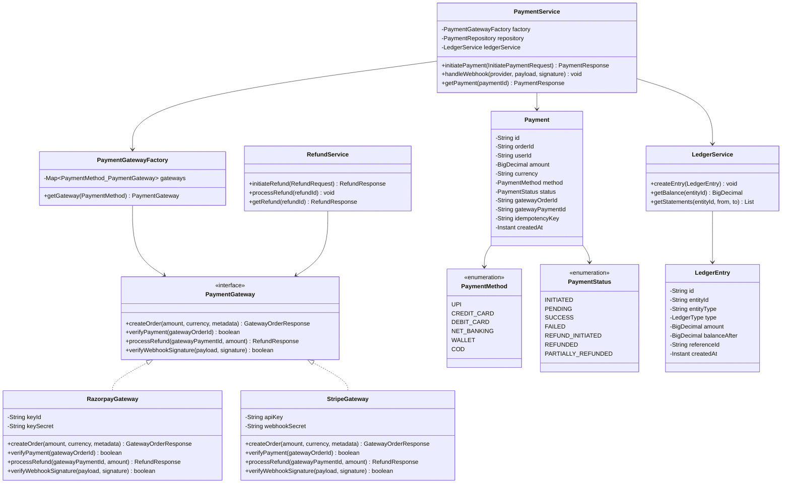
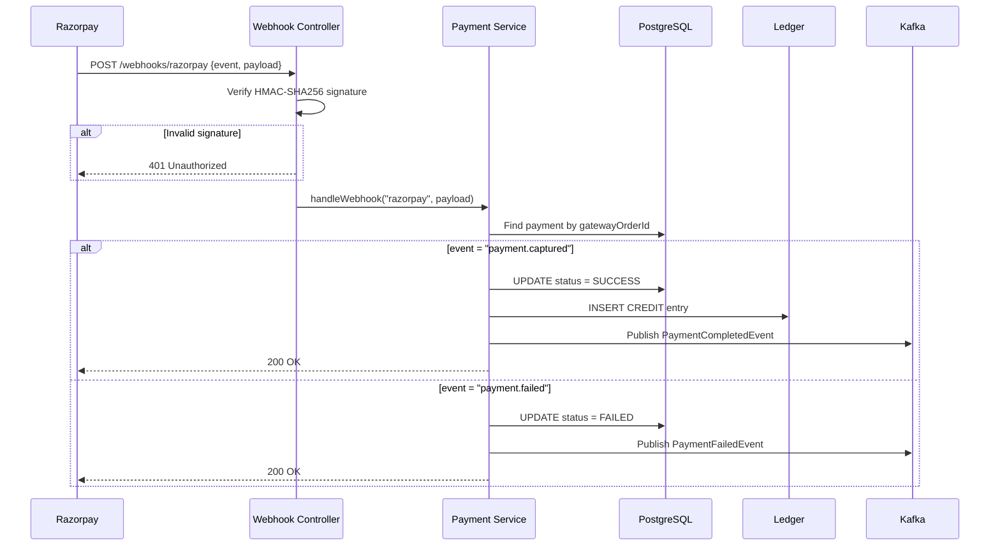
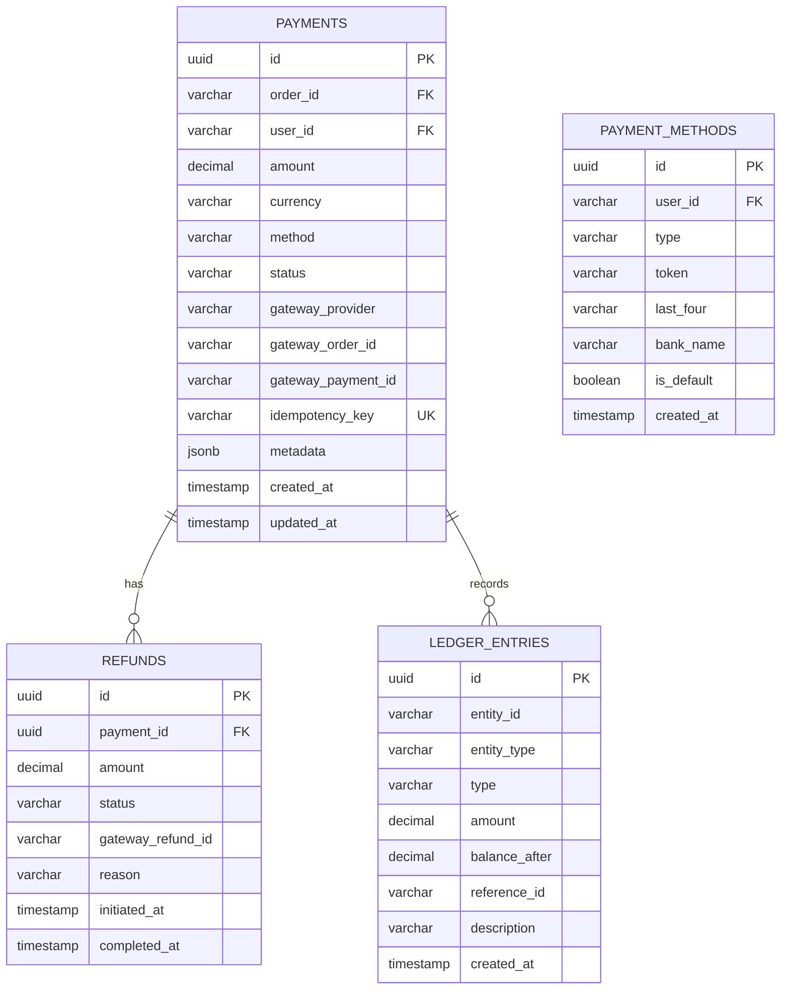

# 💳 Payment Service — Low-Level Design

## 1. Strategy Pattern Class Diagram

## 2. Payment Gateway Selection

| Payment Method | Primary Gateway | Fallback | Reason |
|---------------|----------------|----------|--------|
| UPI | **Razorpay** | — | Best UPI success rates in India (97%+) |
| Credit Card | **Stripe** | Razorpay | Superior fraud detection + international cards |
| Debit Card | **Razorpay** | Stripe | Better domestic bank coverage |
| Net Banking | **Razorpay** | — | 50+ Indian banks supported |
| Wallet | **Razorpay** | — | PayTM, PhonePe, Amazon Pay |
| COD | **Internal** | — | No gateway needed, manual reconciliation |

## 3. Webhook Processing

## 4. ER Diagram

